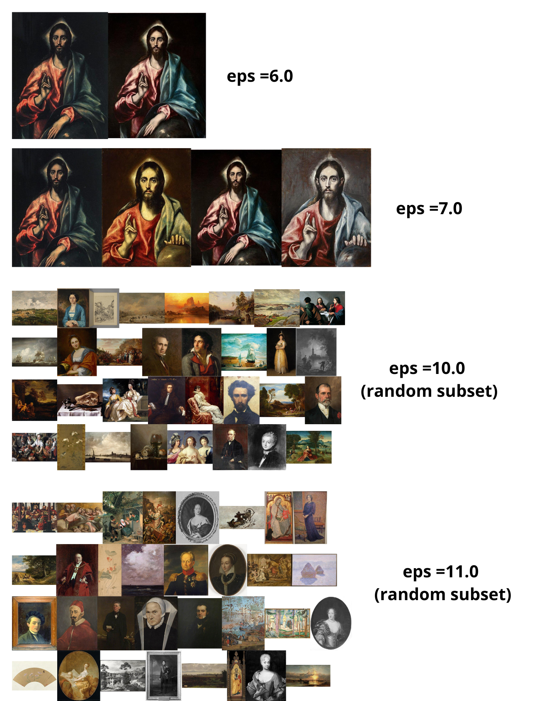
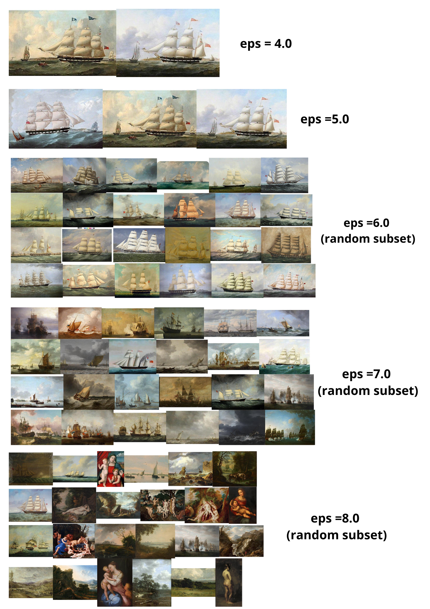

# Clustering and duplicates identification in Paintings on Wikidata

### Basic information

The code was written by Néhémie Frei, MA4 CS Student at EPFL, academic year 2025-2026, supervised by Frédéric Kaplan (DHLAB)

### Introduction

This github hosts the code used to generate the dataset at [https://doi.org/10.5281/zenodo.20270374](https://doi.org/10.5281/zenodo.20270374), to identify duplicate items and potential errors in Wikidata paintings, by using clustering and point matching on the images of the paintings.

### Summary

The images and the metadata were collected using [Wikidata's REST API](https://www.wikidata.org/wiki/Wikidata:REST_API).(186'552 paintings in total)
The images themselves were pulled from [Wikimedia commons](https://commons.wikimedia.org/wiki/Main_Page)

Embeddings for each image were computed using the DINOV3 VITL16 model 
    
Clustering was done using DBScan  with increasing epsilon parameter (from 1 to 11) and a minimum number of points to form a cluster parameter of 2. The eps parameter defines the radius of the neighborhood of a point in the embedding space. If at least MinPoints lie in the neighborhood of a point, a cluster is formed. DBSCAN was picked for it's efficiency for high-dimensional data (1024 in our case), its ability to find clusters of arbitrary shape and the fact that the number of clusters doesn't need to be picked before running the algorithm.

    The increase in the parameter in meant to identify clusters of different nature. Lower values tend to lead to clusters with mostly identical or very similar images images, while higher values lead to larger clusters who tend to have links of different natures (thematic, stylistic or authorly). A total of 15,285 unique clusters were found. . Examples of clusters can be found below

The identification of duplicate images (and thus duplicates in Wikidata too) was done using pairwise Local Feature Matching using LightGluefor images that lied in the same cluster. Pairs of images with an inlier ratio (number of inliers points divided by the total number of matched points) greater than 0.97 and over 100 matched points were labelled as the same physical object. 1275 pairs of images were identified as duplicates. For pairs of images labeled as the same, their metadata was compared to identify fields with inconsistencies. For those who had inconsistencies, they were then re-checked by hand to see if they indeed had any meaningful differences or not.

### Files

All python files used in this project are located in the src folder

*wikidata_api.py :* Used to get images with a precise geolocation using Wikidata's API. A config.py with authentication tokens (which need to be requested [here](https://www.wikidata.org/wiki/Wikidata:REST_API/Authentication)) from Wikidata are needed to run it.

*image_embeddings.py :* Used to compute the embedding for each image using DINOV3

*clusering.py* : Used to calculate the clusters for the embeddings

*dense_sparse_matching.py :* Used to calculate point matching to find duplicate images

*helpers.py* : Helper functions used mainly to vizualize clusters automatically

Requirements for a python enviroment can be found in *requirements.txt*

### License

 Clustering and duplicates identification in Artworks on Wikidata - Néhémie Frei, Frédéric Kaplan
Copyright (c) 2026 Néhémie Frei, Frédéric Kaplan / EPFL
This program is licensed under the terms of the .CC-BY 4.0.
